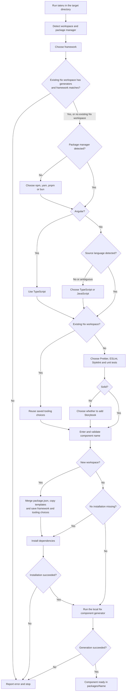

# tateru

Nx workspace for the tateru tools.

Generate React, Angular, Vue, Svelte or Solid component libraries:

```sh
npx jmlivingston/tateru
```

Run in an empty project directory to create a workspace, or in an existing
tateru workspace to add a component. Angular requires TypeScript; other frameworks
support JavaScript or TypeScript. Storybook is offered for all except Solid.

## CLI workflow



Cancelling any prompt exits without generating files. Existing component folders
are rejected. New workspaces preserve existing files but merge `package.json`,
switch it to ESM and scope its name when needed.

See the [functionality and combination matrix](packages/docs/functionality.md)
for the supported options and current limitations.

| Package                       | Description                                    |
| ----------------------------- | ---------------------------------------------- |
| [@tateru/cli](packages/cli)   | Interactive component and workspace scaffolder |
| [@tateru/docs](packages/docs) | Static VitePress documentation                 |

```sh
npm install
npx nx run-many -t test
```

## Code quality

```sh
npm run lint
npm run format
npm run format:check
npm test
```

`npm install` enables Husky hooks. Pre-commit checks lint, formatting and tests
without modifying or staging files. Checkout, merge and rebase hooks run
`npm ci` when the root lockfile changes. Tests use Node's built-in test runner.
Generator templates are excluded from root linting and formatting.

## Documentation

```sh
npm run docs
npx nx run @tateru/docs:build
npx nx run @tateru/docs:preview
```

Markdown content lives in `packages/docs`. Navigation is configured in
`packages/docs/.vitepress/content.json`.

Local development and preview use http://localhost:3000/tateru/.
If port 3000 is occupied, the server reports an error rather than switching ports.

In GitHub **Settings > Pages**, select **GitHub Actions** as the source.
The documentation workflow builds pull requests and deploys pushes to `main`
to https://jmlivingston.github.io/tateru/. It can also be run manually.

Before building, CI writes formatting changes and runs lint and tests. If these
checks pass, it commits and pushes formatting changes to the source branch.
Any failure blocks building and publishing. Branch protection must permit the
workflow's push; fork pull requests must commit formatting changes locally.
Pushes made with `GITHUB_TOKEN` do not trigger another workflow run.

To pause publishing, set `DOCS_PUBLISH_ENABLED` to `'false'` in
`.github/workflows/docs.yml`. Builds still run; set it back to `'true'` to resume.
